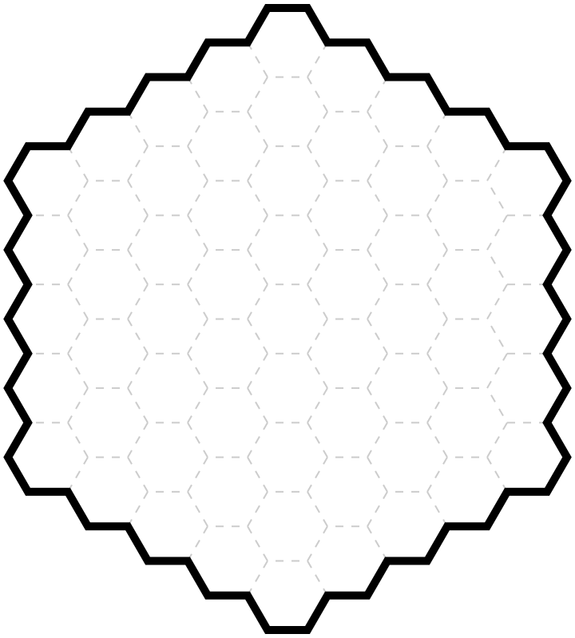
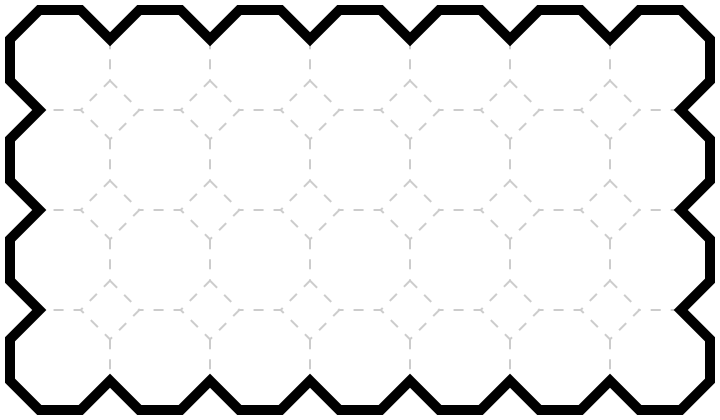
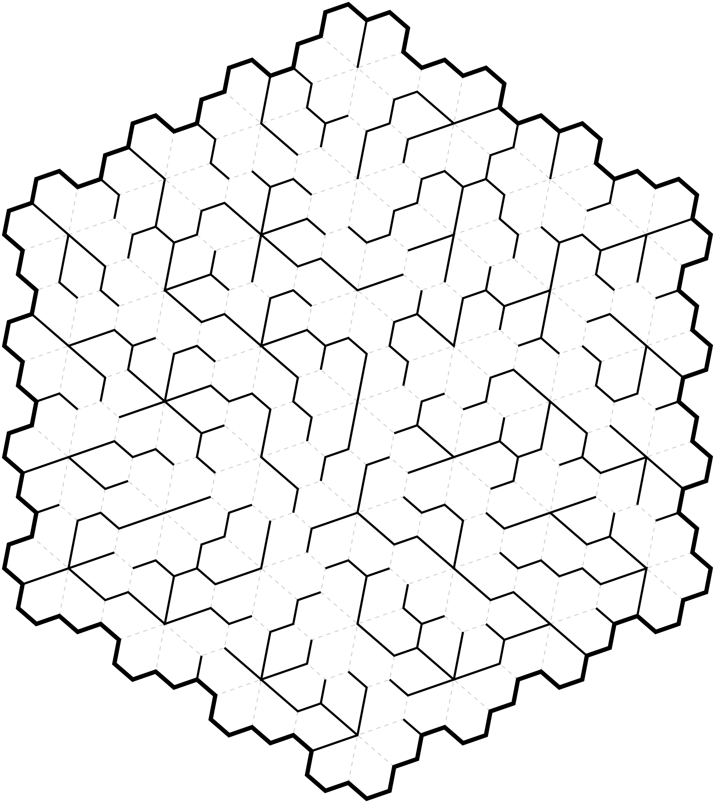
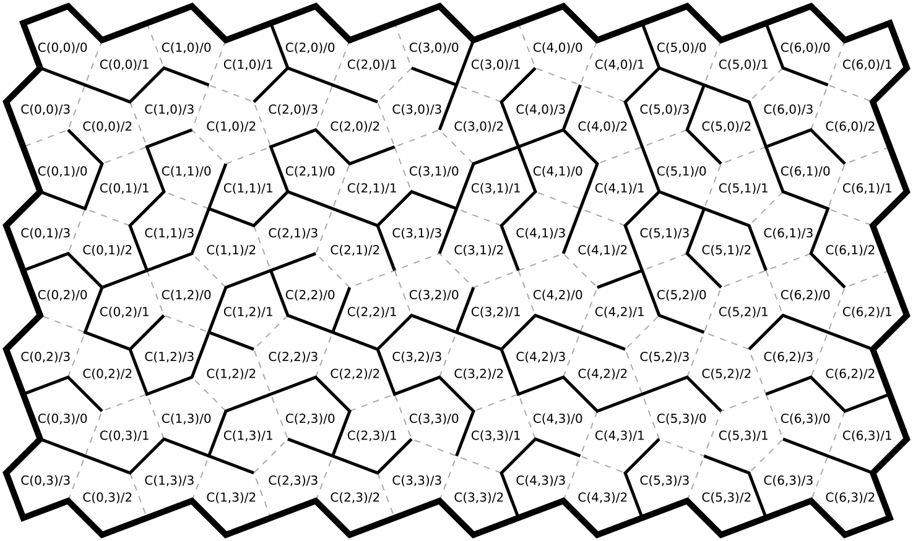
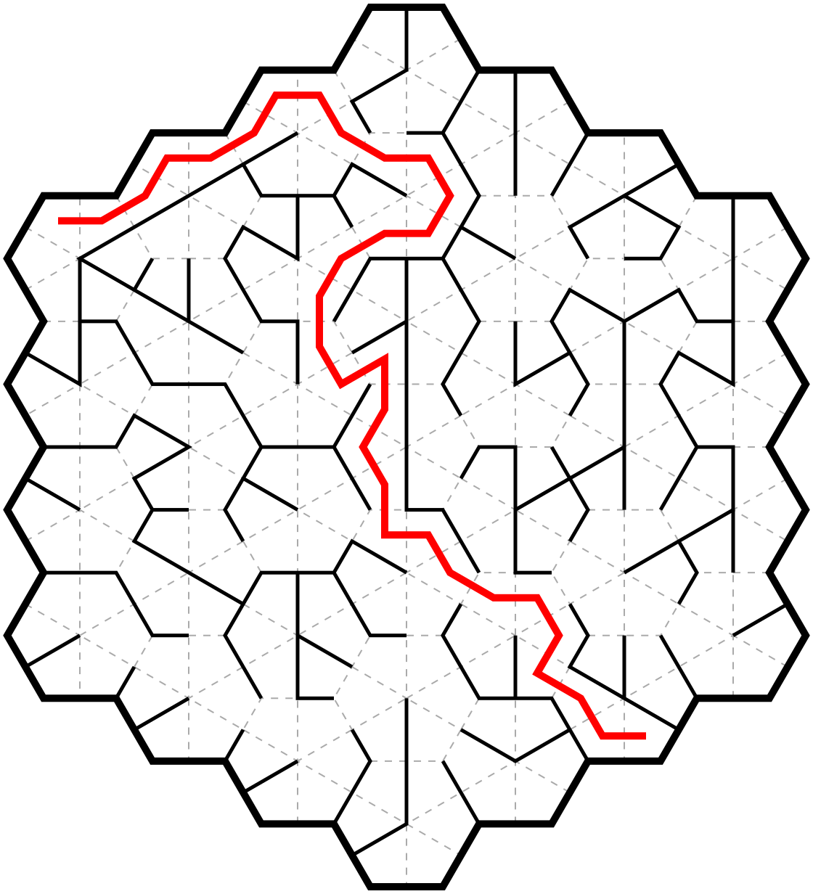
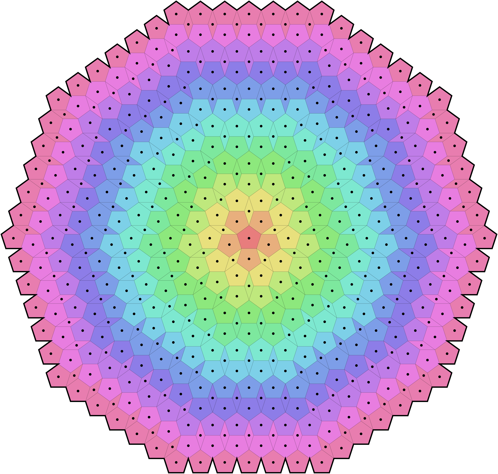
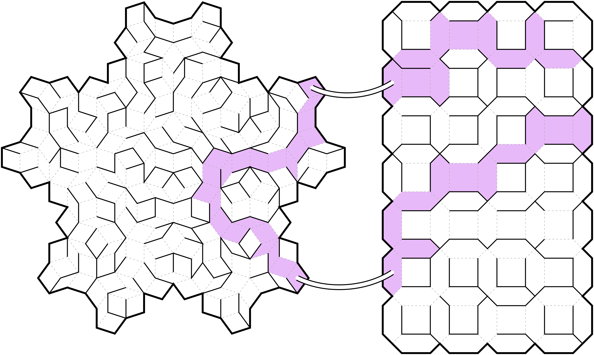

# RT.Coordinates

**[Full documentation](https://docs.timwi.de/RT.Coordinates/RT.Coordinates)**

This small library can generate and manipulate various grid structures, for example:

```cs
File.WriteAllText("output.svg", new Hex.Grid(5).Svg());
```



```cs
File.WriteAllText("output.svg", new OctoCell.Grid(7, 4).Svg());
```



You can generate a random maze:

```cs
File.WriteAllText("output.svg", new Floret.Grid(4).GenerateMaze().Svg());
```



Each cell in each grid geometry has a unique coordinate that identifies each cell:

```cs
File.WriteAllText("output.svg", new Cairo.Grid(7, 4).GenerateMaze().Svg(new SvgInstructions
{
	PerCellAfter = c => $"<text y='.1'>{c}</text>"
}));
```



Find a path in a maze:

```cs
var maze = new Kite.Grid(4).GenerateMaze();
var path = maze.FindPath((Kite) GridUtils.Parse("K(-3,0)/5"), (Kite) GridUtils.Parse("K(2,1)/2"));
File.WriteAllText("output.svg", maze.Svg(new SvgInstructions
{
    ExtraSvg4 = $"<path d='M{path.Select(p => $"{p.Center.X} {p.Center.Y}").JoinString(" ")}' fill='none' stroke='red' stroke-width='.1' />"
}));
```



Customize colors and appearance:

```cs
const int levels = 13;
var maze = new PentaCell.Grid(levels);

File.WriteAllText("output.svg", maze.Svg(new SvgInstructions
{
    HighlightCells = new Func<object, string>(c => c is PentaCell p ? $"hsl({p.Level * 360d / levels}, 70%, 70%)" : null),
    PerCellAfter = c => "<circle r='.1' />",
    PassagesPath = d => $"<path d='{d}' fill='none' stroke-width='.01' stroke='black' stroke-opacity='.7' />"
}));
```



Multiple grid geometries can be combined and connected with bridges. Note that in the following example, the entire structure is a single maze — the only path connecting the cells shown involves use of the bridges.

```cs
var structure = new Structure<object>(
	new Penrose.Grid(true, 3).Cells.Cast<object>()
		.Concat(new Chamf.Grid(4, 7).Cells.Cast<object>()));
structure.AddLink(GridUtils.Parse("P(5,2,4,-1)/2/8"), GridUtils.Parse("H(0,1)/2"));
structure.AddLink(GridUtils.Parse("P(-3,4,1,6)/2/0"), GridUtils.Parse("H(0,5)/2"));
var maze = structure.GenerateMaze();
var path = maze.FindPath(GridUtils.Parse("H(3,1)/1"), GridUtils.Parse("H(4,2)/2"));

File.WriteAllText("output.svg", maze.Svg(new SvgInstructions
{
	GetCenter = c => c is Chamf p ? p.Center + new PointD(12, -8) : null,
	GetVertexPoint = v => v is Chamf.Vertex p ? p.Point + new PointD(12, -8) : v.Point,
	HighlightCells = path
}));
```

